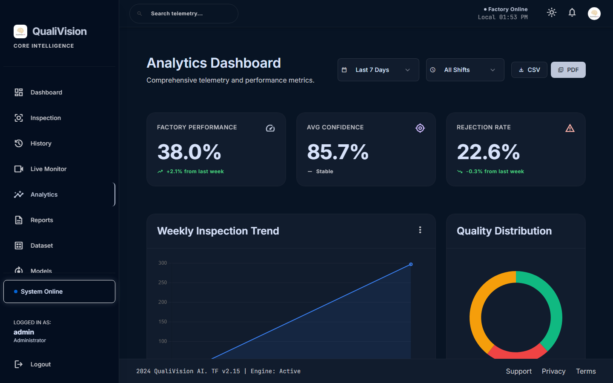
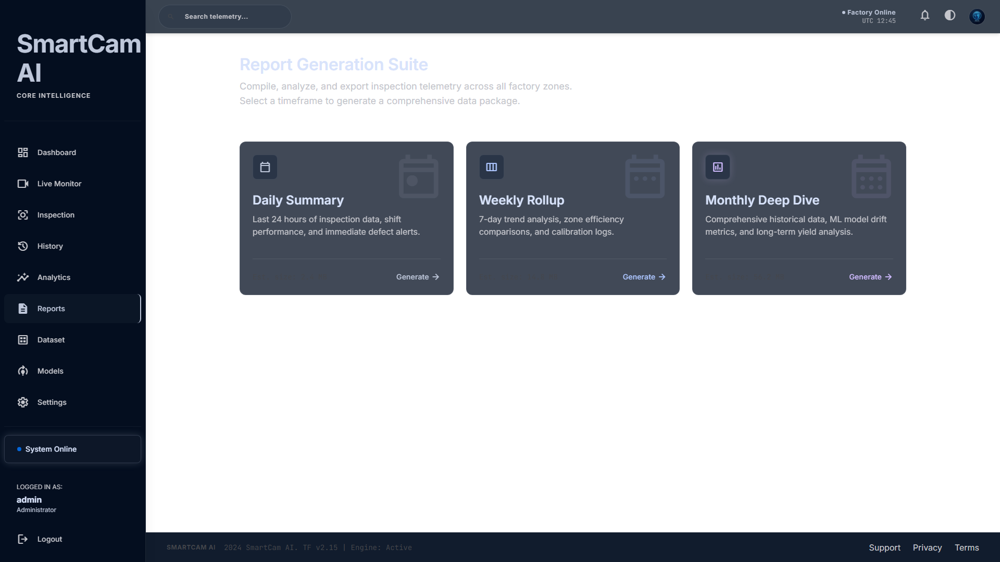
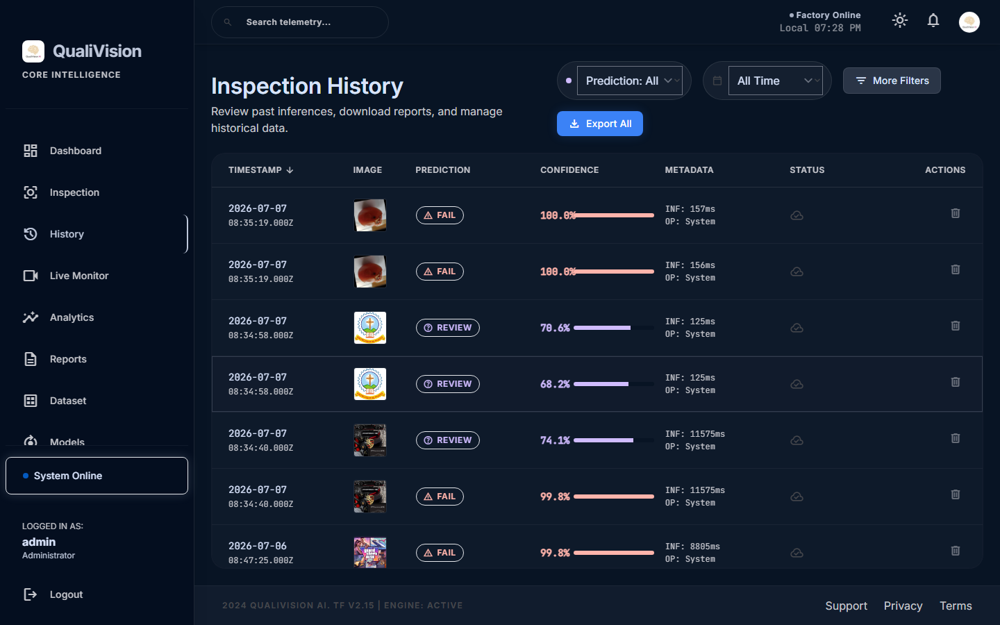
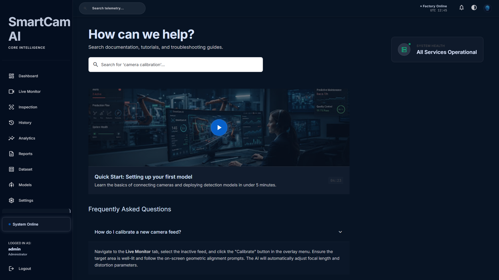
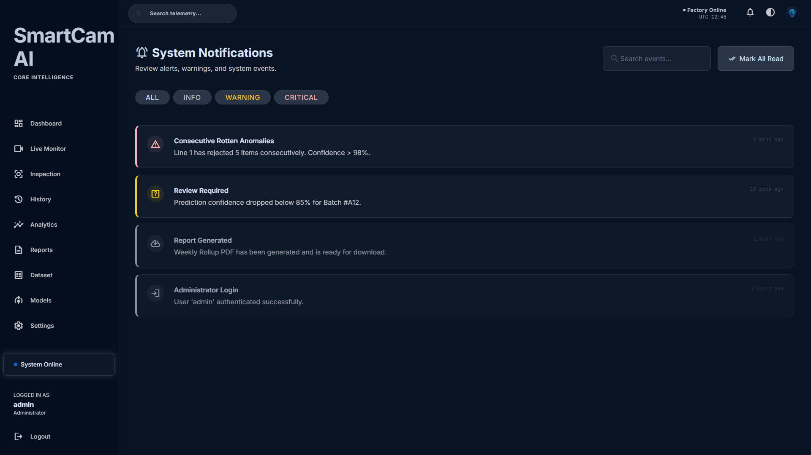
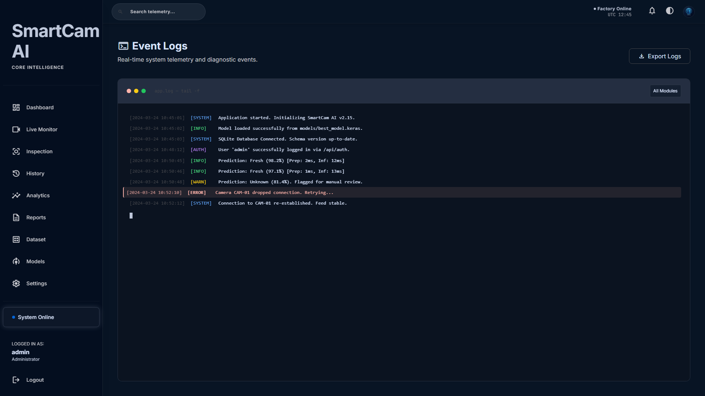
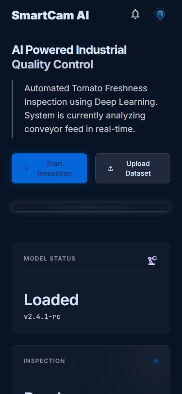
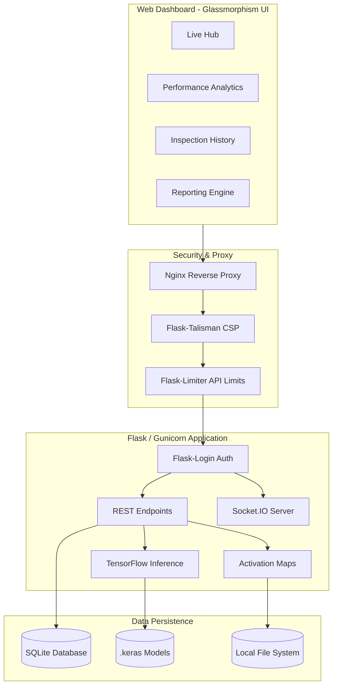
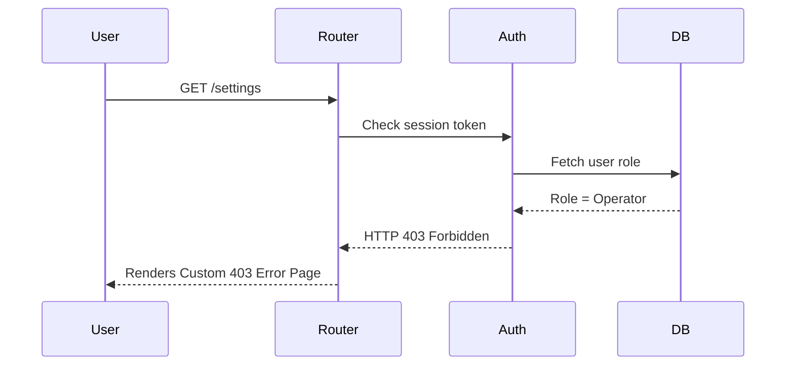

# SmartCam AI — Industrial Quality Control System

<p align="center">
  
</p>

> **AI-powered automated inspection system** utilizing deep learning (EfficientNetV2B0) and computer vision for high-throughput food manufacturing quality control.

---

## 🌟 Overview & Key Features

SmartCam AI is an enterprise-grade industrial quality control dashboard that captures live feed imagery from production line cameras and classifies tomatoes as **Fresh**, **Rotten**, or **Unknown**. Built on a highly-optimized Flask backend with a beautiful, responsive Google Stitch UI (Glassmorphism design language).

- **Triple-Class Probability Logic**: Avoids binary pitfalls. Items are flagged as PASS (Fresh > 85%), FAIL (Rotten > 85%), or REVIEW REQUIRED to prevent false classifications.
- **Explainable AI (Grad-CAM)**: Generates real-time heatmaps outlining the exact regions of the image that influenced the neural network's decision.
- **Role-Based Access Control (RBAC)**: Secure multi-tenant architecture locking sensitive panes (Settings, Models, Reports) to Managers and Administrators.
- **Real-Time Telemetry**: Seamless WebSocket (Socket.IO) streaming of inference times, CPU/RAM utilization, and model confidence scores.
- **Advanced Export Pipelines**: Generates dynamic CSV, JSON, Excel, and beautifully formatted PDF shift reports using `reportlab`.

---

## 📸 Application Gallery

### 1. Dashboard & Monitoring
| Executive Dashboard | Live Monitoring Hub |
|:---:|:---:|
|  |  |

### 2. Deep Learning Inspection
| Batch Inspection Module | Dataset Repository |
|:---:|:---:|
|  |  |

### 3. Analytics & Reporting
| Performance Analytics | Intelligent Reports |
|:---:|:---:|
|  |  |

### 4. Management & History
| Inspection History | Model Management |
|:---:|:---:|
|  |  |

### 5. Enterprise Features
| System Settings | Knowledge Center |
|:---:|:---:|
|  |  |

### 6. Administration
| Notifications Center | System Logs |
|:---:|:---:|
|  |  |

### 7. Responsive Design
| Dark Mode | Light Mode | Mobile View |
|:---:|:---:|:---:|
|  |  |  |

---

## 🏗️ System Architecture

### Component Architecture


### Authentication & RBAC Flow


---

## 🔌 API Documentation

### 1. Predict Image
**Endpoint:** `POST /api/predict`
Inspects a single image or batch of images from the factory line.

- **Content-Type**: `multipart/form-data`
- **Parameters**: 
  - `image` (File)
  - `source` (String: 'upload', 'batch', 'camera_feed')
- **Response**:
```json
{
  "inspection_id": "QC-20260703-142205",
  "prediction": "Rotten",
  "confidence": 98.2,
  "status": "FAIL",
  "timeline": {
    "Image Loaded": "5 ms",
    "Preprocessing": "3 ms",
    "AI Inference": "28 ms",
    "Total": "36 ms"
  }
}
```

### 2. Download Shift Reports
**Endpoint:** `GET /api/reports/download`
Downloads the historical DB metrics compiled into a flat file. Protected by `@login_required`.

- **Parameters**:
  - `timeframe` (String: 'daily', 'weekly', 'monthly')
  - `format` (String: 'pdf', 'csv', 'excel', 'json')
- **Response**: `application/pdf` or corresponding binary file attachment.

---

## 🚀 Production Deployment (Docker)

SmartCam AI is containerized for simple and scalable deployments using **Docker** and **Docker Compose**. It operates on a robust Gunicorn WSGI server behind an Nginx reverse proxy.

### Prerequisites
- [Docker Engine](https://docs.docker.com/get-docker/)
- [Docker Compose](https://docs.docker.com/compose/install/)

### Deploying the Stack
1. Clone the repository and navigate into the folder:
   ```bash
   git clone https://github.com/JiphinGeorge/SmartCam-AI---Industrial-Quality-Control-System.git
   cd SmartCam-AI
   ```
2. Build and spin up the multi-container stack:
   ```bash
   docker-compose up --build -d
   ```
   *This initializes the web application (Gunicorn/Flask), Nginx on ports 80/443, and persistent volumes for the SQLite database and image uploads.*
3. Access the dashboard at `http://localhost` or your server's IP address.
4. Default Logins:
   - **Admin**: `admin` / `admin123`
   - **Manager**: `manager` / `manager123`
   - **Operator**: `operator` / `operator123`

---

## 💻 Local Development Setup

If you wish to modify the AI models or the UI frontend, you can run the system locally:

```bash
# 1. Create and activate a virtual environment
python -m venv venv310
venv310\Scripts\activate

# 2. Install dependencies
pip install -r requirements.txt

# 3. Start the Flask dev server
python app.py
```
*The server will be available at `http://127.0.0.1:5000`.*

---

## 🛠 Technology Stack

- **Deep Learning**: TensorFlow 2.10, Keras (EfficientNetV2B0), OpenCV
- **Backend Framework**: Flask 3.0, Flask-SocketIO, Gunicorn (Production)
- **Security**: Flask-Login (RBAC), Flask-Talisman, Flask-Limiter, Werkzeug Security
- **Frontend UI**: Google Stitch (Glassmorphism), TailwindCSS, Chart.js
- **Persistence**: SQLite (with performance indexing)
- **Data Export**: ReportLab (PDF), OpenPyXL (Excel), Python CSV/JSON

---

## ⚖️ License
Internal Industrial Use Only. Not authorized for external distribution.
