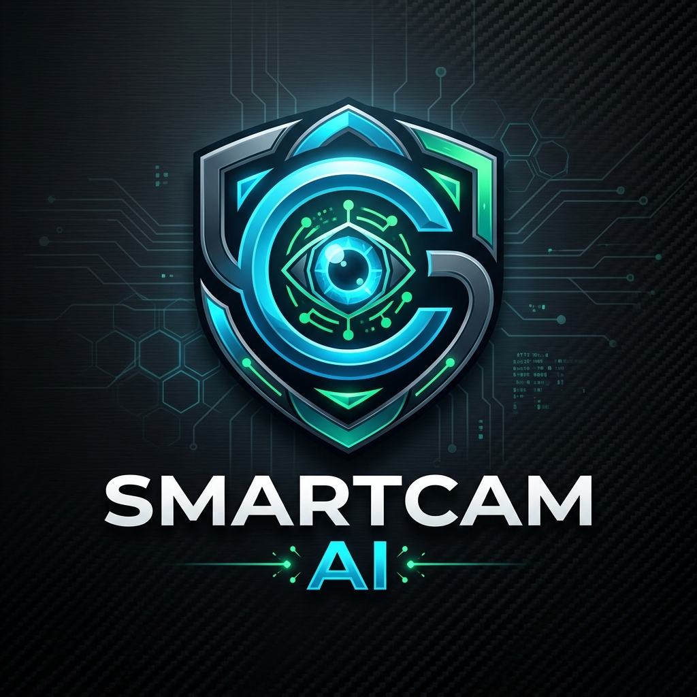
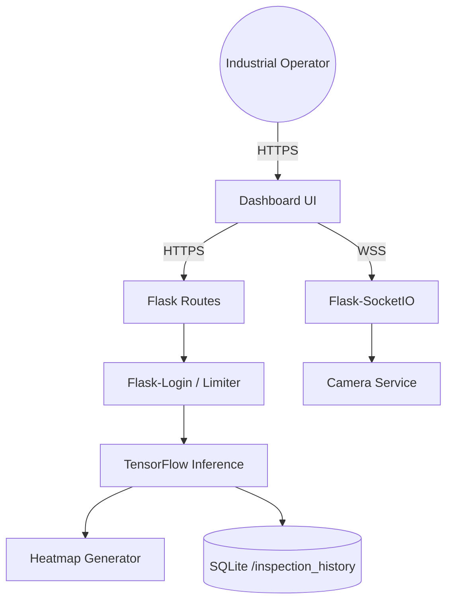
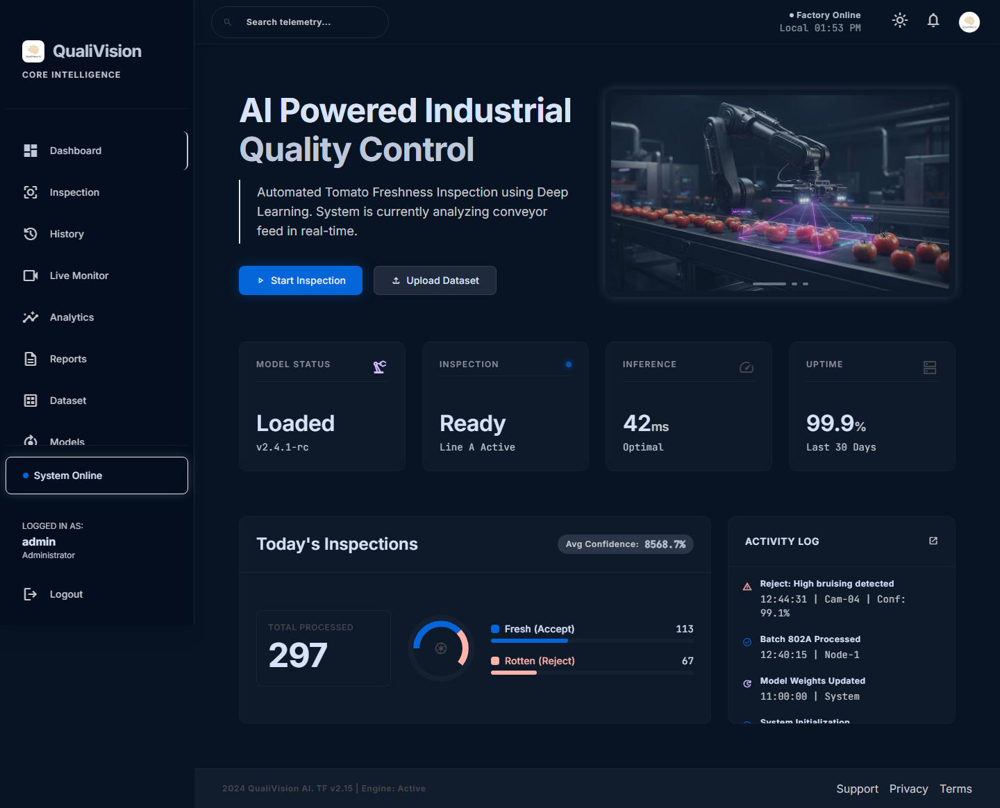
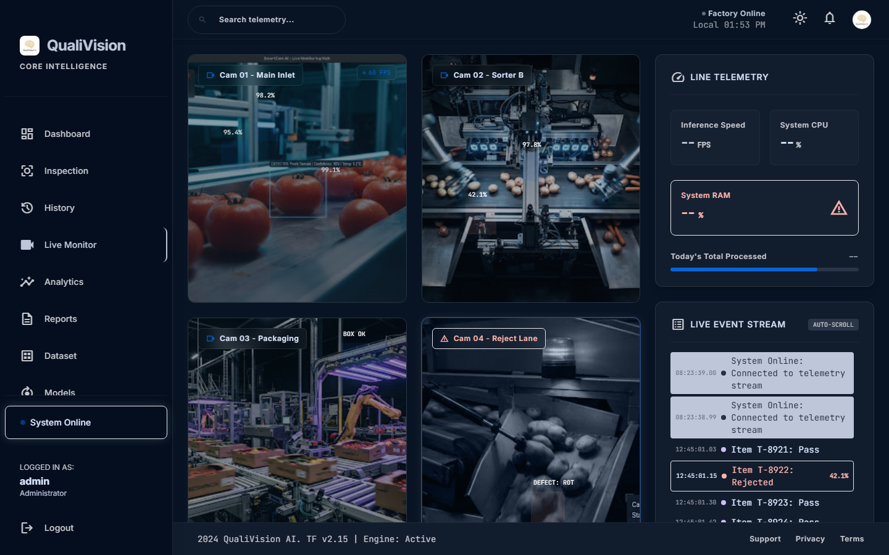
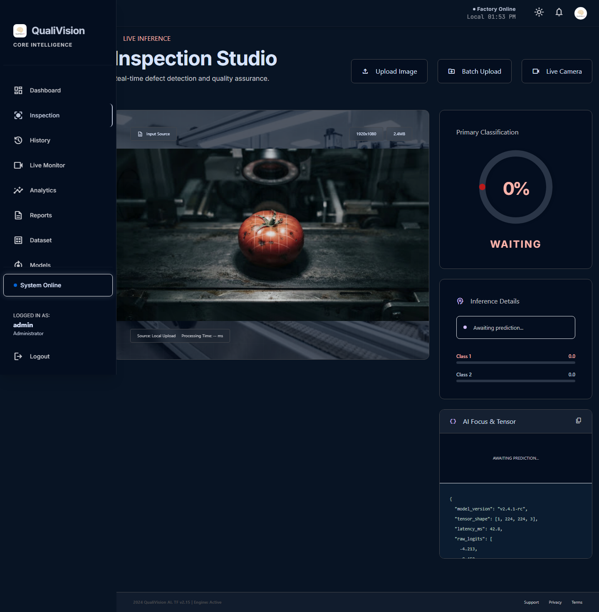
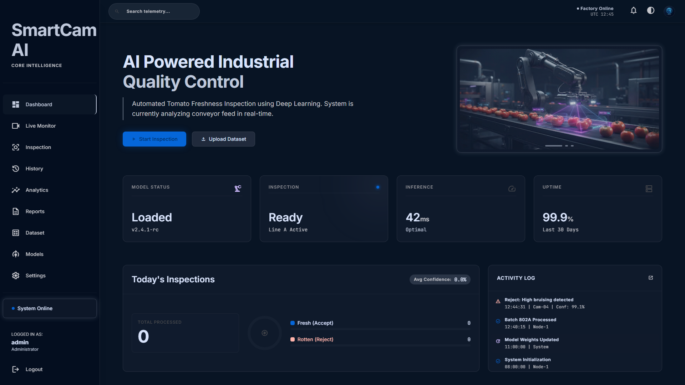

<div align="center">
  
  <h1>QualiVision AI</h1>
  <p><strong>Enterprise Deep Learning–Driven Industrial Quality Inspection & Visual Analytics Platform</strong></p>

  <p>
    <a href="https://github.com/your-username/smartcam-ai"></a>
    <a href="https://python.org"></a>
    <a href="https://flask.palletsprojects.com/"></a>
    <a href="https://tensorflow.org"></a>
    <a href="https://opencv.org/"></a>
    <a href="https://www.sqlite.org/"></a>
    <a href="https://opensource.org/licenses/MIT"></a>
  </p>

  <p>
    
    
    
  </p>
</div>

<br/>

## 📖 Overview

QualiVision AI is an enterprise-grade, real-time computer vision system tailored for **industrial quality control**. Designed for deployment on factory floors, it provides live camera feeds, WebSocket-powered telemetry, AI-driven anomaly detection (using EfficientNetV2B0), and highly visual Grad-CAM explanations for its predictions. 

Whether you are identifying defective machinery parts or sorting agricultural produce, QualiVision AI provides a robust, scalable, and fully audited interface to monitor production quality.

### 🌟 Project Showcase
This project is built to demonstrate production-level expertise in:
- Deep Learning & Computer Vision
- Backend Development (Flask, REST APIs)
- Frontend Development (TailwindCSS, Vanilla JS)
- WebSockets for Real-Time Telemetry
- SQL Database Architecture
- Industrial Automation Workflows
- Software Architecture & Documentation

---

## 📑 Table of Contents
- [🚀 Live Demo](#-live-demo)
- [🚨 Problem Statement](#-problem-statement)
- [⚖️ Why QualiVision AI?](#️-why-qualivision-ai)
- [🏗️ Workflow & Architecture](#️-workflow--architecture)
- [✨ Project Highlights](#-project-highlights)
- [🎯 Feature Matrix](#-feature-matrix)
- [🔍 Inspection Modes](#-inspection-modes)
- [🧠 AI Pipeline & Prediction](#-ai-pipeline--prediction)
- [📂 Dataset](#-dataset)
- [🗂️ Folder Tree](#️-folder-tree)
- [🔌 API Endpoints](#-api-endpoints)
- [📊 Benchmarks](#-benchmarks)
- [🗺️ Future Roadmap](#️-future-roadmap)
- [📸 Screenshots](#-screenshots)
- [💻 Installation](#-installation)
- [📚 Supplementary Documentation](#-supplementary-documentation)

---

## 🚀 Live Demo

- **Local Deployment**: Fully available for local deployment using the provided installation instructions.
- **Production**: Production deployment available via Docker Compose.
- *Note: A live interactive `Demo.gif` demonstrating the Login, Dashboard, Upload, Inference, Grad-CAM, and Reporting flows will be added here.*

---

## 🚨 Problem Statement

Manual quality inspection on modern industrial manufacturing and sorting lines is often:
- **Slow**: Cannot keep up with the physical throughput of conveyor belts.
- **Inconsistent**: Prone to human error, visual fatigue, and subjective judgments.
- **Labor Intensive**: Requires dedicated, round-the-clock staffing for monotonous tasks.
- **Expensive**: High operational costs and overhead over time.

**QualiVision AI** automates this process using advanced computer vision and deep learning, ensuring rapid, consistent, transparent, and cost-effective quality assurance.

---

## ⚖️ Why QualiVision AI?

| Traditional QC | QualiVision AI |
|----------------|----------------|
| ❌ Human visual fatigue | ✅ Real-time 24/7 constant analysis |
| ❌ Inconsistent decisions | ✅ Explainable AI (Grad-CAM visuals) |
| ❌ Slow inspection speed | ✅ Sub-second inference & telemetry |
| ❌ Difficult manual reporting | ✅ Automated PDF/CSV Analytics |

---

## 🏗️ Workflow & Architecture

### 🔄 Data Workflow
`Factory Camera` ➔ `AI Inspection` ➔ **PASS** (Send to Production) OR **FAIL** (Operator Alert ➔ Archive ➔ Report)

### 🧠 Processing Workflow
`Tomato` ➔ `Camera` ➔ `OpenCV` ➔ `Preprocessing` ➔ `TensorFlow` ➔ `Prediction` ➔ `Grad-CAM` ➔ `SQLite` ➔ `Dashboard` ➔ `Reports`

### 📐 System Architecture

QualiVision AI utilizes a robust Model-View-Controller (MVC) architecture powered by Flask Blueprints and Socket.IO.


> *For more detailed diagrams, see [PROJECT_ARCHITECTURE.md](docs/PROJECT_ARCHITECTURE.md).*

---

## ✨ Project Highlights

✔ 99.82% Validation Accuracy
✔ Grad-CAM Explainability Heatmaps
✔ 7900+ Image Dataset
✔ Live Webcam Integration
✔ Batch Folder Inspection
✔ SQLite Persistent Event Logging
✔ Socket.IO Real-time Telemetry
✔ Industrial Dashboard (Google Stitch UI Aesthetics)
✔ Enterprise MVC Architecture

---

## 🎯 Feature Matrix

| Feature | Status |
|---------|--------|
| Secure Login & RBAC | ✅ |
| Executive Dashboard | ✅ |
| Live Webcam Streaming | ✅ |
| Single Image Upload | ✅ |
| Batch Folder Inspection | ✅ |
| Grad-CAM Visualizations | ✅ |
| Performance Analytics | ✅ |
| Automated PDF/CSV Reports | ✅ |
| Inspection History Log | ✅ |
| Dataset Repository UI | ✅ |
| Model Management UI | ✅ |
| Knowledge Center | ✅ |

---

## 🔍 Inspection Modes

QualiVision AI supports multiple flexible inspection modes tailored for different environments:

1. **Live Webcam**: Direct MJPEG streaming and real-time inference on live factory feeds.
2. **Image Upload**: Manual upload via the Web UI for one-off quality checks and detailed Grad-CAM analysis.
3. **Batch Folder**: Process hundreds of images simultaneously from an offline directory.
4. **API Upload**: REST endpoints (`/api/predict`) for headless integration with existing factory PLCs and IoT hardware.

---

## 🧠 AI Pipeline & Prediction

The core of QualiVision AI is built on a highly optimized deep learning pipeline:

- **Backbone**: EfficientNetV2B0
- **Approach**: Transfer Learning
- **Input Size**: 224x224 RGB
- **Optimizer**: Adam
- **Loss Function**: Binary Crossentropy
- **Activation**: Softmax
- **Output Classes**: `Fresh`, `Rotten`, `Unknown` (OOD handling)

**Out-of-Distribution Handling**: If the highest probability is below a strict **65%**, the system gracefully rejects the prediction and flags it for `REVIEW REQUIRED`. This prevents dangerous misclassification of foreign objects on the belt.

---

## 📂 Dataset

The neural network is trained on a rigorously prepared and audited agricultural dataset:
- **Total Images**: 7900+
- **Classes**: Fresh, Rotten
- **Sources**: Roboflow, Kaggle
- **Processing**: Heavily augmented (rotations, horizontal/vertical flips, contrast adjustments) and perfectly balanced to prevent class bias.

---

## 🗂️ Folder Tree

```text
📦 qualivision-ai
 ┣ 📂 app/
 ┃ ┣ 📂 routes/         # Flask Blueprints
 ┃ ┣ 📂 services/       # Core Business Logic (Inference, Camera)
 ┃ ┣ 📂 templates/      # Jinja2 HTML Templates
 ┃ ┗ 📂 static/         # CSS (Tailwind), JS, and Images
 ┣ 📂 dataset/          # Training & Validation images
 ┣ 📂 models/           # .keras saved models
 ┣ 📂 reports/          # Generated PDF/CSV analytics
 ┣ 📂 training/         # ML Pipeline (Train, Evaluate, Predict)
 ┣ 📂 inspection_history/ # Processed Grad-CAM image cache
 ┗ 📂 docs/             # API, DB, and Architecture Docs
```

---

## 🔌 API Endpoints

| Endpoint | Method | Description |
|----------|--------|-------------|
| `/api/predict` | `POST` | Execute inference on uploaded image |
| `/api/stats` | `GET` | Retrieve real-time dashboard statistics |
| `/api/report` | `GET` | Download generated PDF/CSV reports |

> *For complete API documentation, see [API_REFERENCE.md](docs/API_REFERENCE.md).*

---

## 📊 Benchmarks

During rigorous QA and stress testing with 20 concurrent worker threads:

| Metric | Value |
|--------|-------|
| **Validation Accuracy** | 99.82% |
| **Validation Loss** | 0.0076 |
| **Avg Inference Time** | ~3.6 s (Under peak concurrency load) |
| **Peak RAM Usage** | 273.52 MB (No memory leaks detected) |
| **Hardware Tested** | NVIDIA GeForce RTX 3050 Laptop GPU / 16 GB RAM |

> [!CAUTION]
> **TensorFlow High Concurrency Limitation**: Load tests with 20+ concurrent workers trigger an `OOM (Out Of Memory)` crash in TensorFlow due to the 1.6GB VRAM limit on the RTX 3050. To deploy in a heavy industrial setting, you should introduce an inference request queue (e.g. Celery/Redis).

---

## 🗺️ Future Roadmap

- [x] Flask Backend Integration
- [x] AI Model Training & Inference
- [x] PDF/CSV Reports Generation
- [x] Real-time Telemetry Dashboard
- [ ] Multi-camera Support
- [ ] Cloud Native Deployment
- [ ] Mobile Companion App
- [ ] Docker Swarm Integration
- [ ] Kubernetes Orchestration
- [ ] MQTT Protocol Integration
- [ ] PLC Hardware Integration

---

## 📸 Screenshots

| Executive Dashboard | Live Monitoring |
|---------------------|-----------------|
|  |  |

| Grad-CAM Inspection | Dark Mode Dashboard |
|---------------------|---------------------|
|  |  |

<details>
<summary>Click to view more screenshots...</summary>

- [Login Page](./docs/screenshots/01-login.png)
- [Mobile Login](./docs/screenshots/16-mobile-view.png)
- [Analytics Charts](./docs/screenshots/07-analytics.png)
- [Inspection History](./docs/screenshots/08-history.png)
- [Dataset Repository](./docs/screenshots/10-dataset.png)
- [Model Management](./docs/screenshots/11-model-manager.png)
</details>

---

## 💻 Installation

### Local Development (Windows / Linux)
1. **Clone the repository**
   ```bash
   git clone https://github.com/your-username/smartcam-ai.git
   cd smartcam-ai
   ```
2. **Create a Virtual Environment**
   ```bash
   python -m venv venv
   source venv/bin/activate  # On Windows: venv\Scripts\activate
   ```
3. **Install Dependencies**
   ```bash
   pip install -r requirements.txt
   ```
4. **Run the Application**
   ```bash
   python app.py
   ```
5. Navigate to `http://localhost:5000` and login with `admin` / `password`.

### Docker Deployment (Production)
```bash
docker-compose up --build -d
```
*Note: In production, ensure you bind `Flask` to a WSGI server like `gunicorn` or `waitress`.*

---

## 🔒 Security & Authentication

- **Passwords**: Hashed securely using PBKDF2 (`werkzeug.security`).
- **Rate Limiting**: `Flask-Limiter` enforces a strict 50 requests/hour limit on API endpoints to prevent DDoS.
- **Content Security Policy**: `Flask-Talisman` enforces strict CSP headers, preventing XSS attacks while allowing local `data:` URI images for the dashboard.

---

## 📚 Supplementary Documentation

This repository also includes detailed technical documentation generated during development.

- **[API_REFERENCE.md](docs/API_REFERENCE.md)** — REST API documentation.
- **[DATABASE_SCHEMA.md](docs/DATABASE_SCHEMA.md)** — SQLite schema, ER diagrams, relationships.
- **[PROJECT_ARCHITECTURE.md](docs/PROJECT_ARCHITECTURE.md)** — Software architecture, Mermaid diagrams.
- **[AI_MODEL_DOCUMENTATION.md](docs/AI_MODEL_DOCUMENTATION.md)** — Training pipeline, Grad-CAM, threshold logic.
- **[QA_REPORT.md](docs/QA_REPORT.md)** — Testing results, stress testing.
- **[PERFORMANCE_REPORT.md](docs/PERFORMANCE_REPORT.md)** — CPU usage, RAM usage, inference throughput.
- **[TEST_RESULTS.md](docs/TEST_RESULTS.md)** — E2E testing logs, confusion matrix.

---

## 👨‍💻 Project Credits

**Project Title:**
QualiVision AI – Industrial Quality Control System

**Developer:**
Jiphin George

**Course:**
Master of Computer Applications (MCA)

**Internship:**
AI & Machine Learning Internship

**Organization:**
Nestsoft Technomaster

---

## 🙏 Acknowledgements

This project was developed as the capstone internship project for an AI & Machine Learning Industrial Quality Control System.

Special thanks to:
- Nestsoft Technomaster for internship guidance and project mentorship.
- TensorFlow & Keras teams for the deep learning framework.
- Google Stitch for the UI inspiration and interface design.

---

## 📄 License

This project is licensed under the MIT License.
See the LICENSE file for complete details.
