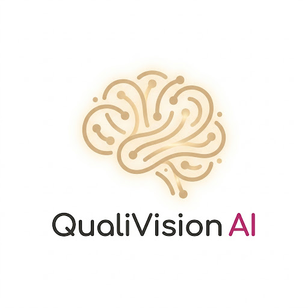
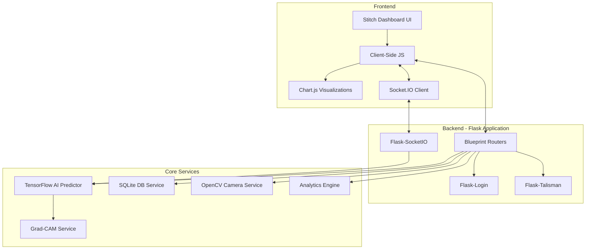

# SmartCam AI — Industrial Quality Control System



SmartCam AI is an enterprise-grade, real-time computer vision system tailored for industrial quality control, specifically designed for real-time inspection, classification, and anomaly detection. The system provides live camera feeds, Grad-CAM heatmap visualization, historical analytics, and automated reporting.

## Features

- **Live Monitoring**: Real-time WebSocket-powered telemetry and MJPEG camera streaming for active inspection.
- **AI Prediction**: Seamless integration with TensorFlow/Keras for immediate image classification (e.g. Fresh vs Rotten).
- **Grad-CAM Explanations**: Visual heatmaps highlighting the exact regions of interest the AI used to make its predictions.
- **Historical Analysis**: Comprehensive data tables, pagination, and filtering for past inspections.
- **Analytics Dashboard**: Interactive Chart.js graphs displaying weekly trends, hourly volume, and quality metrics (Pass/Fail ratios).
- **Data Management**: Upload images, capture directly from the live feed, and manage training/testing datasets directly from the UI.
- **Security & Performance**: Flask-Login authentication, Flask-Limiter rate limiting, and Talisman CSP protections.

## Architecture

The system uses a modular MVC pattern powered by Flask and standard web technologies.



## Setup & Installation

### Requirements
- Python 3.10+
- A compatible webcam (for live inference)

### 1. Environment Setup
Create a virtual environment and install dependencies:
```bash
python -m venv venv
venv\Scripts\activate
pip install -r requirements.txt
```

### 2. Database Initialization
The SQLite database will automatically be initialized upon the first run in `database/smartcam.db`.

### 3. Running the Server
Run the application using the entry point:
```bash
python app.py
```

Access the dashboard at `http://localhost:5000` or the IP address indicated in the console.

## Project Structure
- `/app`: The core Flask application, blueprints, templates, and static assets.
  - `/routes`: Blueprint route definitions (e.g. `api.py`, `dashboard.py`).
  - `/services`: Core business logic (e.g. `database.py`, `predictor.py`, `gradcam.py`).
  - `/templates`: Jinja2 HTML templates.
  - `/static`: CSS, Javascript, and Images.
- `/database`: SQLite storage directory.
- `/dataset`: Training and testing images for model fine-tuning.
- `/inspection_history`: Historical captures and generated Grad-CAM heatmaps.
- `/logs`: Centralized application logs.
- `/models`: Saved `.keras` models and training summaries.
