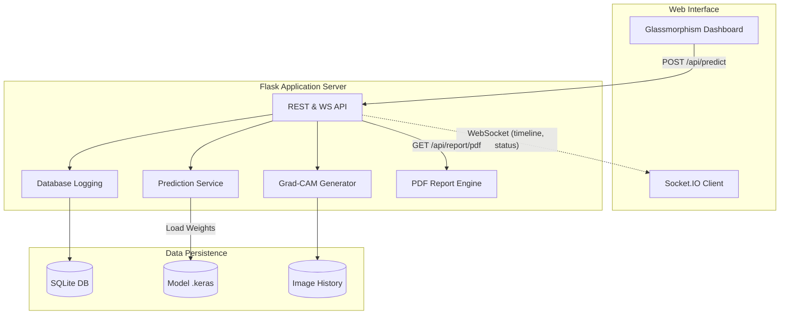

# SmartCam AI — Industrial Quality Control System


> AI-powered tomato freshness inspection using deep learning for food manufacturing quality control.

## Overview

SmartCam AI is an enterprise-grade industrial quality control system that uses computer vision to classify tomatoes as **Fresh**, **Rotten**, or **Unknown** on a production conveyor belt. 

Built with TensorFlow (EfficientNetV2B0) and deployed via a robust Flask backend with a premium Glassmorphism UI, this system is designed for high-throughput factory environments.

---

## 🌟 Key Features

- **Triple-Class Probability Logic**: Accurately flags items as PASS (Fresh > 85%), FAIL (Rotten > 85%), or UNKNOWN to prevent false classifications.
- **Explainable AI (Grad-CAM)**: Visualizes the exact regions of the image that influenced the model's decision.
- **Industrial Dashboard**: Real-time circular confidence gauges, dynamic AI explanations, and granular processing timelines.
- **Batch Processing Mode**: Drag-and-drop entire folders of images for high-speed batch inspection with progress tracking.
- **Automated PDF Reporting**: Generate professional industrial shift reports using `reportlab`.
- **Admin & Settings Panels**: Password-protected routes for database management and system configuration.
- **Responsive Corporate Theme**: Built-in Dark and Light mode toggles tailored for factory displays.

---

## 🏗 System Architecture



---

## 🚀 Quick Start

### 1. Setup Environment
```bash
python -m venv venv310
venv310\Scripts\activate
pip install -r requirements.txt
```

### 2. Run the Application Server
```bash
python app.py
```
*The server will start on `http://127.0.0.1:5000`.*

---

## 🔌 API Documentation

### `POST /api/predict`
Inspect a single image or batch of images.
- **Payload (`multipart/form-data`)**: `image` (File), `source` (String: 'upload', 'batch', 'webcam')
- **Response**:
  ```json
  {
    "inspection_id": "QC-20260703-142205",
    "prediction": "Rotten",
    "confidence": 98.2,
    "confidence_level": "Very High",
    "status": "FAIL",
    "explanation": "The AI model classified this tomato as Rotten with high confidence...",
    "timeline": {
      "Image Loaded": "5 ms",
      "Preprocessing": "3 ms",
      "AI Inference": "28 ms",
      "Grad-CAM": "18 ms",
      "Database": "4 ms",
      "Total": "58 ms"
    }
  }
  ```

### `GET /api/stats`
Retrieve today's production statistics.
- **Response**: JSON object with `total_today`, `fresh_count`, `rotten_count`, `unknown_count`, `avg_confidence`, `avg_time`.

### `GET /api/report/pdf`
Downloads a generated PDF report summarizing the current day's inspections.

---

## 🛠 Project Structure

```
SmartCam-AI/
├── app/
│   ├── routes/              # Flask Blueprints (api.py, dashboard.py)
│   ├── services/            # Core Logic (predictor, gradcam, pdf_generator, database)
│   ├── templates/           # HTML templates (index, admin, settings, about)
│   └── static/              # CSS/JS Assets
├── database/                # SQLite Storage
├── models/                  # Trained EfficientNetV2B0 (.keras)
├── requirements.txt         # Dependencies
└── app.py                   # Main entry point
```

## ⚖️ License
Internal Industrial Use Only.
