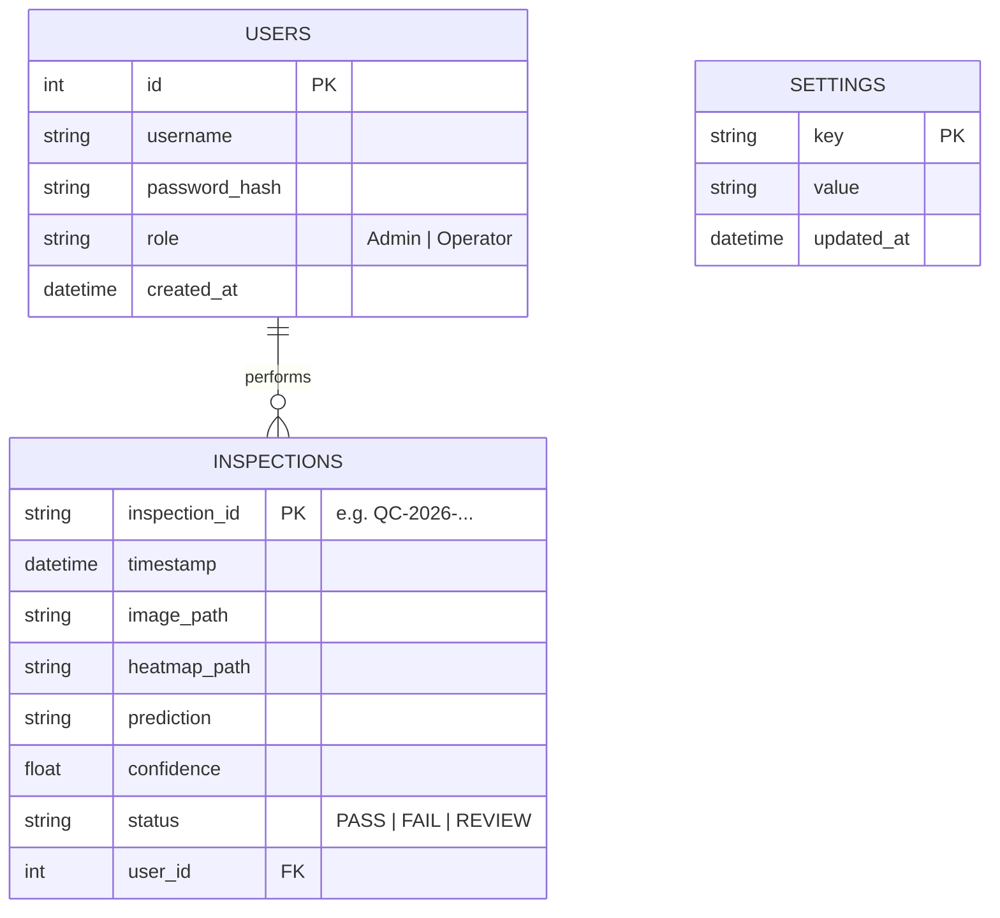

# Database Schema

QualiVision AI utilizes SQLite for local embedded storage. The database file is located at `database/smartcam.db`.

## Entity Relationship Diagram

## Tables

### 1. `users`
Stores application users, their hashed passwords, and RBAC roles.
- `id` (INTEGER, Primary Key)
- `username` (VARCHAR 255, Unique)
- `password_hash` (VARCHAR 255): Generated via `werkzeug.security`.
- `role` (VARCHAR 50): Defines access levels.

### 2. `inspections`
Stores historical data of all predictions made by the AI model.
- `inspection_id` (VARCHAR 255, Primary Key): Unique alphanumeric ID.
- `timestamp` (DATETIME): UTC time of the inspection.
- `image_path` (VARCHAR 500): Relative path to the original uploaded image.
- `heatmap_path` (VARCHAR 500): Relative path to the generated Grad-CAM heatmap.
- `prediction` (VARCHAR 50): Text label (e.g., "Fresh", "Rotten").
- `confidence` (FLOAT): Percentage confidence (0.0 to 100.0).
- `status` (VARCHAR 20): "PASS", "FAIL", or "REVIEW REQUIRED".
- `user_id` (INTEGER): Foreign Key linking to the operator logged in during the inspection.

### 3. `settings`
Key-Value store for dynamic application configurations.
- `key` (VARCHAR 255, Primary Key): e.g., `confidence_threshold`.
- `value` (VARCHAR 255): e.g., `65.0`.
- `updated_at` (DATETIME)
