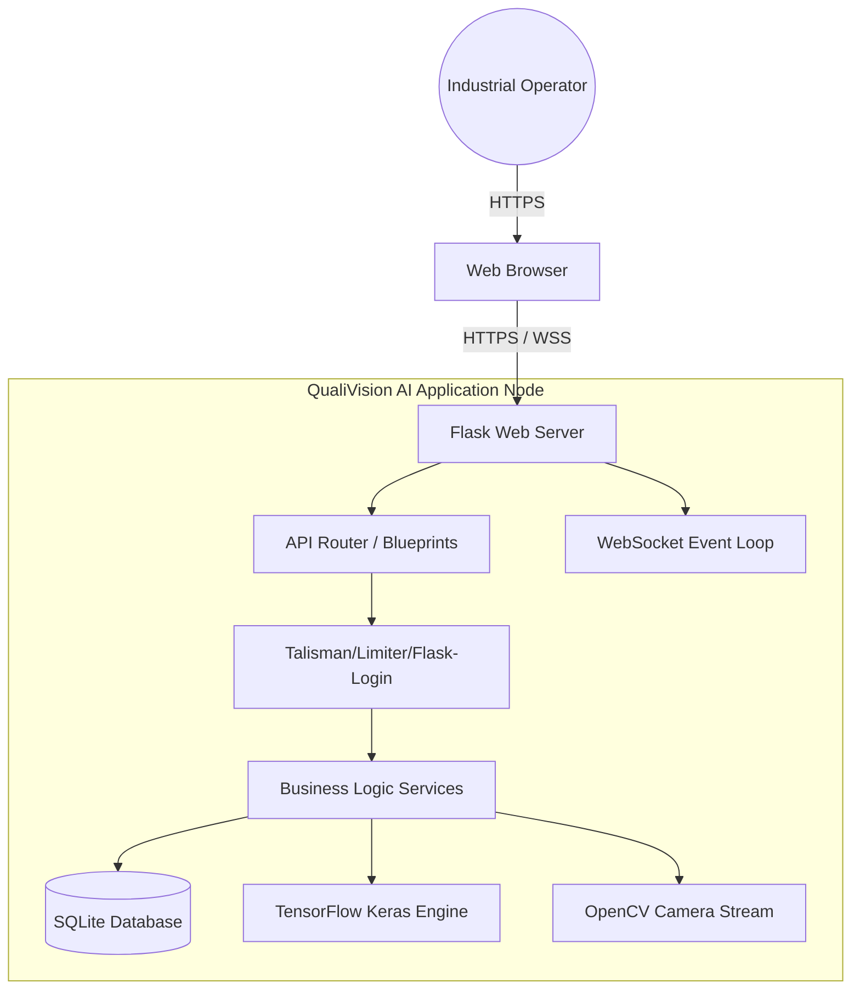
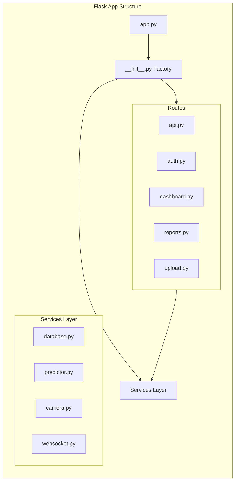
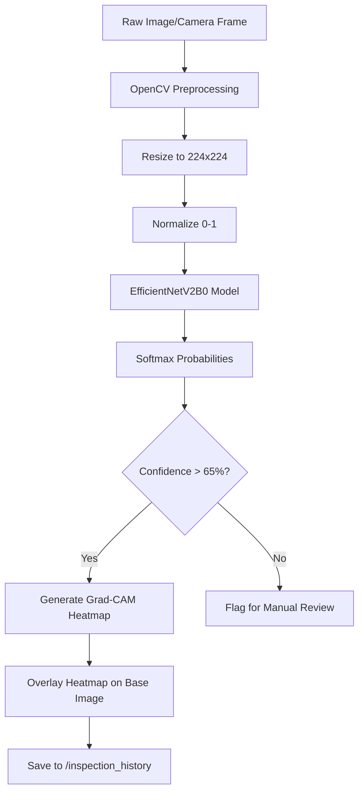
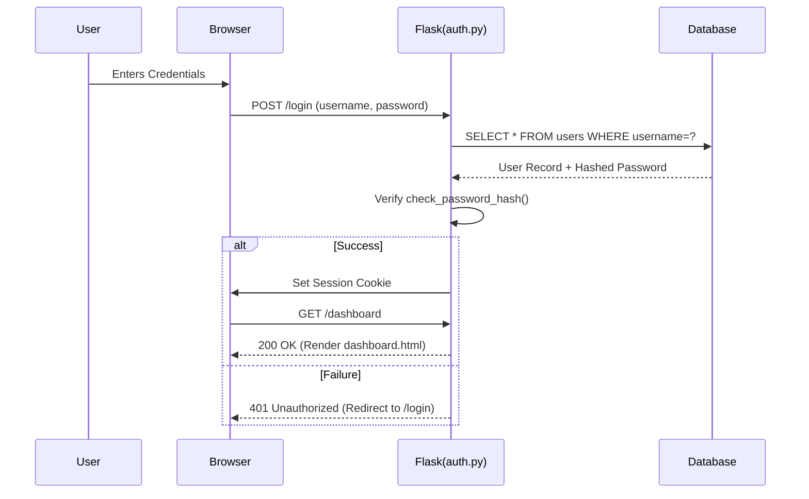
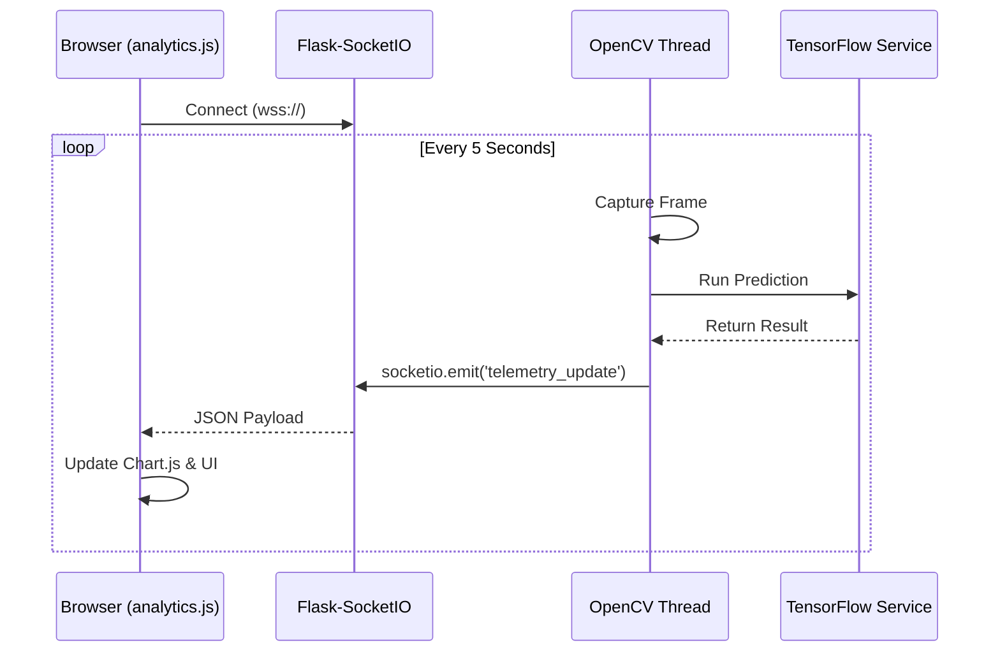

# QualiVision AI - High Level Architecture

This document contains detailed architectural diagrams for the QualiVision AI Industrial QC System.

## 1. High Level Architecture

## 2. Backend Architecture

## 3. AI Pipeline

## 4. Authentication Flow

## 5. Live Monitoring Flow (WebSocket)

